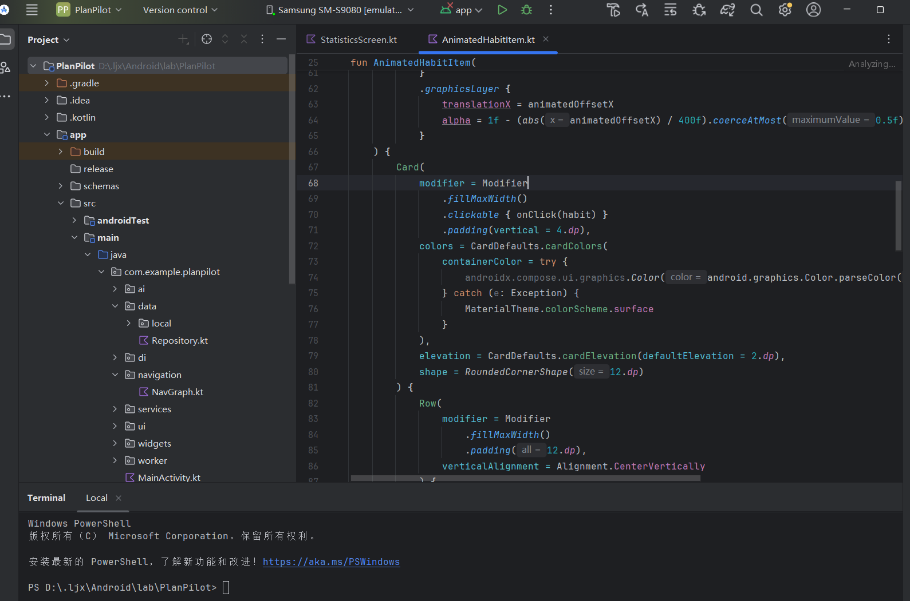
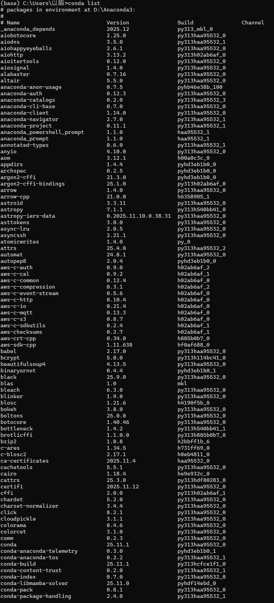
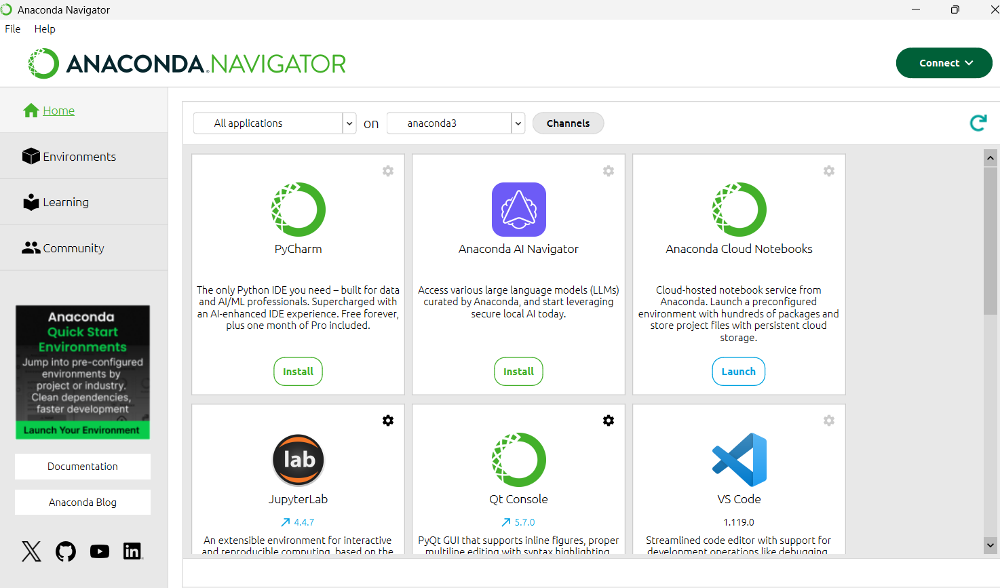
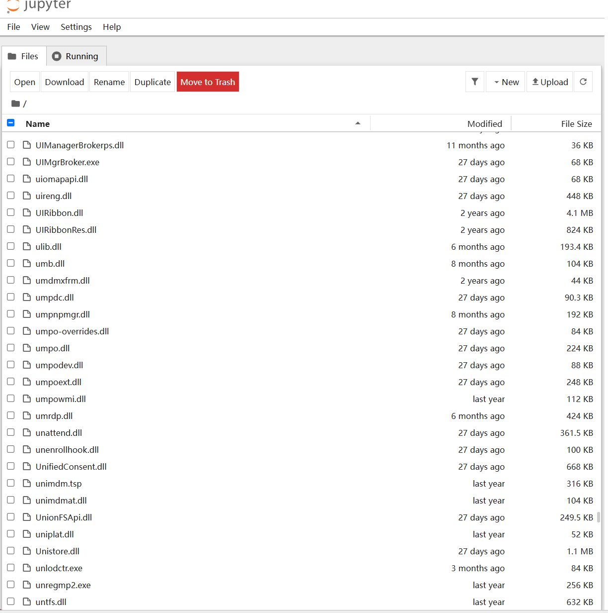
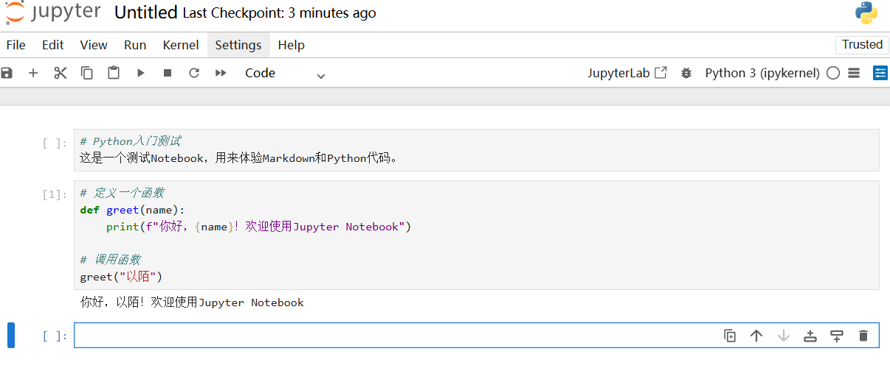
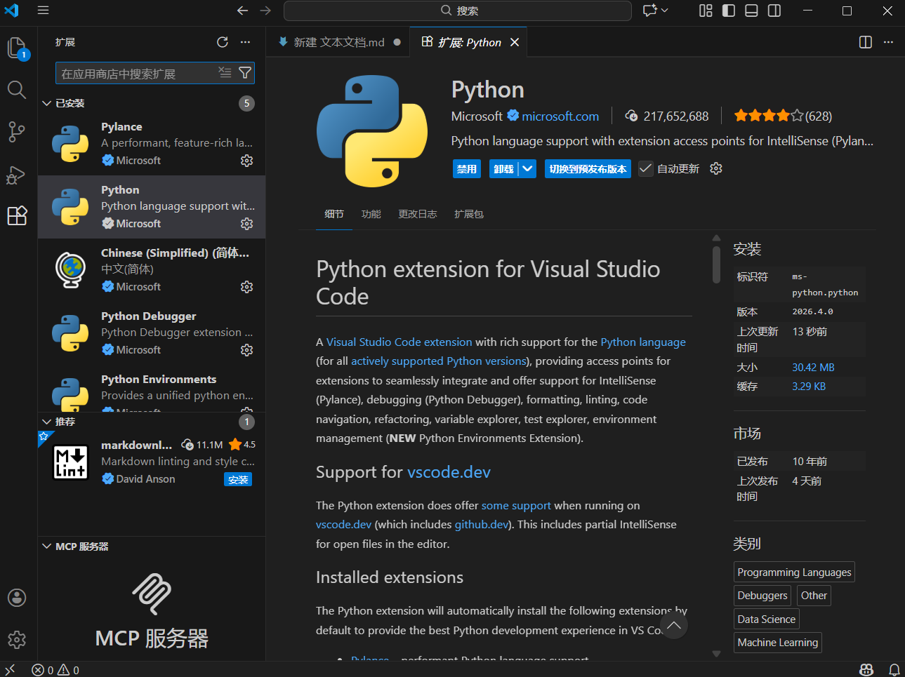

# 课程软件安装实验报告

## 1 安装课程所需软件实验内容

本实验需要安装以下软件：
- **Android Studio 4.1以上版本**：更好的支持LiteRT，最新版本为Android Studio Panda 3
- **Jupyter Notebook和相关Python环境**：用于机器学习模型构建
- **Visual Studio Code**：代码编辑器

完成安装后，探索软件使用，将安装过程以Markdown语法描述并上传至Github(或Gitee)。

---

## 2 Android Studio

### 2.1 安装要求
- 安装Android Studio 4.1以上版本，更好的支持LiteRT
- 最新版本为Android Studio Panda 3

### 2.2 Gradle配置
Android应用的编译依赖gradle工具，需要下载大量的gradle封装器、工具包以及项目的依赖库。考虑使用阿里云云效Maven作为镜像源，以加快下载速度。

### 2.3 新建项目与编译运行
完成Android Studio安装之后，新建一个Android应用并编译运行。第一次编译运行时将会下载gradle相关的依赖库。

---

## 3 Jupyter Notebook

### 3.1 概述
Jupyter Notebook 是一种交互式计算与开发环境，将**代码、运行结果、公式、图表和文字说明**集成在同一个文档中，便于教学、实验、数据分析和模型开发。

### 3.2 核心特点
- **交互式编程**：代码可按单元逐段运行，便于调试与验证
- **多内容融合**：支持 Markdown、LaTeX 公式、图片、表格与可视化结果
- **数据分析友好**：常与 Python、NumPy、Pandas、Matplotlib 等工具配合使用
- **便于教学与展示**：适合演示算法过程、实验步骤和分析结论
- **可复现性强**：完整保留代码、参数、输出结果与说明文档

### 3.3 典型应用场景
数据分析、机器学习实验、教学演示、科研计算、原型验证

---

## 4 Jupyter Notebook 安装（非首选方法）

> **不建议使用此方法**，推荐使用Anaconda安装

### 4.1 安装Python
1. 从[Python官方网站](https://www.python.org/)下载安装包
2. 安装之后，在命令提示符中键入 `python --version` 查看版本号

### 4.2 安装Jupyter Notebook
1. 以管理员身份运行"命令提示符"
2. 执行安装命令：`pip install notebook`
3. 启动Notebook：`jupyter notebook`

---

## 5 Jupyter Notebook安装成功界面

Jupyter Notebook启动后，会在浏览器中打开界面，显示当前目录下的文件列表。

---

## 6 Anaconda（首选安装方式）

### 6.1 Anaconda简介
Anaconda 提供了在单台机器上执行Python/R数据科学和机器学习的最简单方法。Anaconda包含了conda、Python在内的数以千计的科学包及其依赖项。

### 6.2 conda工具
conda是一个包、环境的管理工具，主要用在python、机器学习的开发中：
- 可以进行独立python环境的创建与隔离
- 可以在不同环境中切换
- 在各自环境中安装各自所需的包

### 6.3 下载地址
从[Anaconda官方网站](https://www.anaconda.com/products/distribution#download-section)下载对应操作系统的安装包。

---

## 7 安装Anaconda（1/3）

参考Anaconda介绍、安装及使用教程进行安装。

### 注意事项：
- 安装路径不能包含中文、空格等特殊字符
- 选择"Just me"选项，否则需要管理员权限
- 使用Anaconda作为默认的Python环境

---

## 8 安装Anaconda（2/3）

继续按照安装向导进行配置。

### 注意事项：
- 确保勾选"Add Anaconda to my PATH environment variable"选项（可选，便于在命令行直接使用conda命令）
- 可以选择注册Anaconda Cloud（可选）

---

## 9 安装Anaconda（3/3）

安装完成后验证是否安装成功：

### 验证方法：
1. **方法一**：开始 → Anaconda3 (64-bit) → Anaconda Navigator，启动成功说明安装成功
2. **方法二**：开始 → Anaconda3（64-bit）→ 右键点击Anaconda Prompt → "以管理员身份运行"，输入 `conda list` 查看已安装的包名和版本号

---

## 10 使用Anaconda Navigator启动Notebook

### 10.1 启动Navigator
启动Anaconda Navigator导航界面，并从导航界面启动Jupyter Notebook。

### 10.2 更改默认目录
Notebook启动之后，默认的Files列出了用户文件夹的项目。如需更改默认加载目录，可以通过修改Jupyter Notebook配置文件实现。

### 10.3 创建Notebook
新建一个Notebook（Python 3），查看界面布局，并尝试写一些文本和代码。

---

## 11 安装Visual Studio Code

### 11.1 软件介绍
Visual Studio Code（VS Code）是一款优秀的跨平台协同代码编辑器，采用插件式开发，支持众多编程语言和环境，如Python和Jupyter等。

### 11.2 下载安装
- 下载地址：[Visual Studio Code](https://code.visualstudio.com/)
- 安装完成后，下载并安装以下插件：
  - Python
  - Jupyter
  - Jupyter Keymap

### 11.3 创建Notebook
在VS Code中创建Notebook，参考官方文档：[Getting Started to Work With Jupyter Notebooks in Visual Studio Code](https://code.visualstudio.com/docs/datascience/jupyter-notebooks)

---

## 12 实验总结

通过本次实验，我成功安装了以下软件：
1. **Android Studio**：用于Android应用开发，支持LiteRT
2. **Anaconda + Jupyter Notebook**：用于数据分析和机器学习模型构建
3. **Visual Studio Code**：用于代码编辑和Notebook开发

这些软件为后续的课程学习和实践打下了坚实的基础。