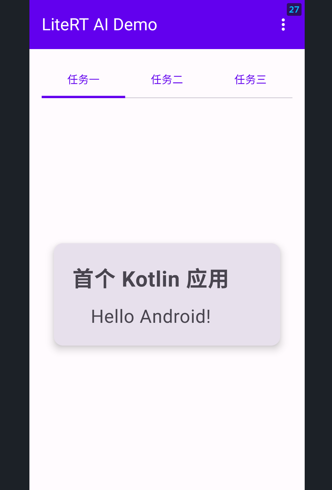
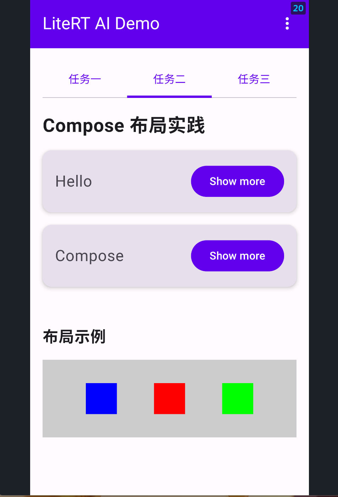
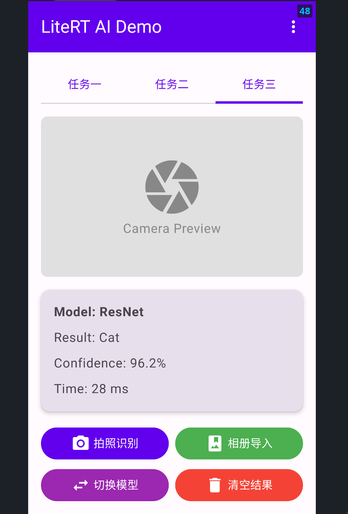
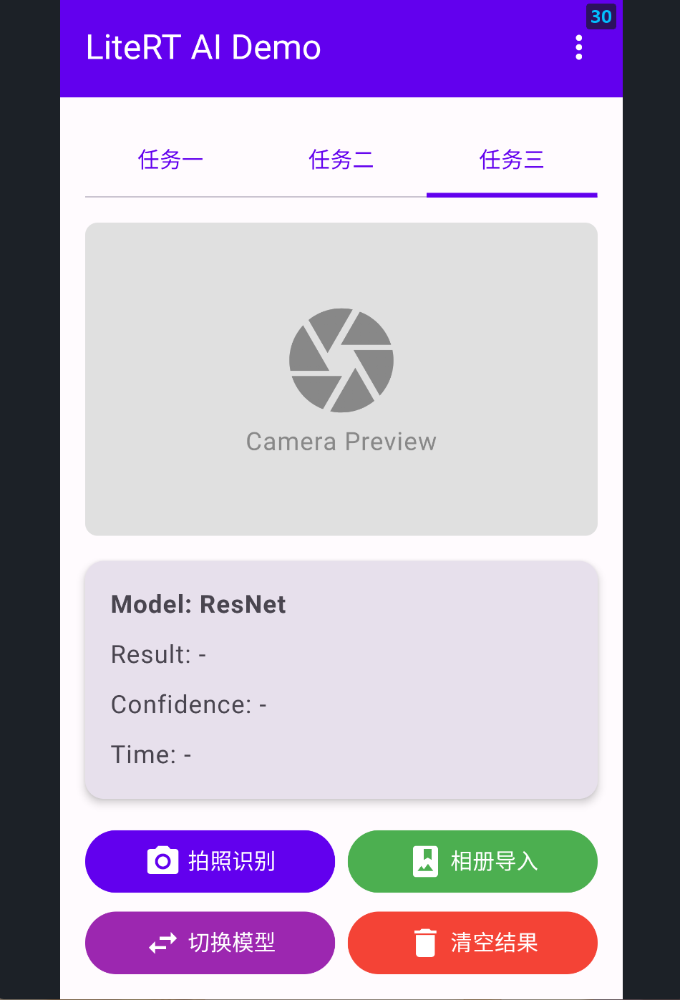
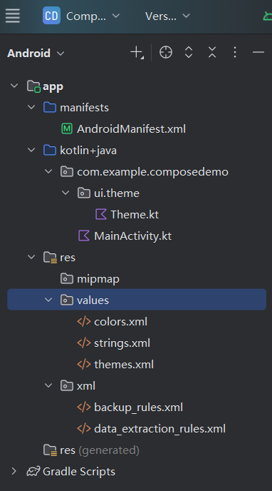

# LiteRT AI Demo - Compose 实验项目

**实验报告**

***

## 一、实验目的

1. 掌握使用 Kotlin 语言开发 Android 的基本流程
2. 掌握 Android Compose 布局的基本用法
3. 进一步熟悉 Kotlin 语言的特性

***

## 二、实验环境

| 项目                    | 版本                         |
| --------------------- | -------------------------- |
| Android SDK           | 16.0 (API Level 36)        |
| 最低支持 SDK              | API Level 21 (Android 5.0) |
| Kotlin                | 2.0.0                      |
| Android Gradle Plugin | 8.5.0                      |
| JDK                   | 17                         |
| Android Studio        | Jellyfish (2024.1.1)       |

***

## 三、实验内容与完成情况

### 3.1 任务一：创建首个 Kotlin 应用

**任务要求**：

- 选择创建 Empty Activity
- 使用 Kotlin 语言
- 应用名为 ComposeDemo
- 最小支持 API Level 21
- 显示 "Hello Android!" 问候语

**完成情况**：✅ 已完成

**运行效果**：



***

### 3.2 任务二：实践 Compose 布局

**任务要求**：

- 使用 Compose 组件进行界面布局
- 展示 Row、Column、Box 等布局的使用
- 包含按钮和卡片组件的示例

**完成情况**：✅ 已完成

**运行效果**：



***

### 3.3 任务三：面向 AI 应用的 Compose 布局

**任务要求**：

- **顶部栏**：显示应用标题
- **预览区**：相机预览占位，后续可替换为 CameraX
- **结果区**：显示模型名称、识别结果、置信度、推理时间
- **按钮区**：拍照识别、相册导入、切换模型、清空结果

**完成情况**：✅ 已完成

#### 3.3.1 识别结果展示



#### 3.3.2 清空结果状态



***

## 四、项目结构



```
ComposeDemo/
├── app/
│   ├── src/
│   │   └── main/
│   │       ├── java/com/example/composedemo/
│   │       │   ├── MainActivity.kt          # 主界面，包含所有任务
│   │       │   └── ui/theme/
│   │       │       ├── Color.kt             # 颜色定义
│   │       │       ├── Theme.kt             # 主题配置
│   │       │       └── Type.kt              # 字体配置
│   │       └── res/
│   │           ├── values/
│   │           │   ├── strings.xml
│   │           │   └── themes.xml
│   │           └── xml/
│   │               ├── backup_rules.xml
│   │               └── data_extraction_rules.xml
│   ├── build.gradle.kts                     # 应用级 Gradle 配置
│   └── proguard-rules.pro
├── image/                                   # 截图目录
├── build.gradle.kts                         # 项目级 Gradle 配置
├── settings.gradle.kts
├── gradle.properties
└── README.md                                # 实验报告
```

***

## 五、核心代码说明

### 5.1 MainScreen 主界面

主界面使用 `Scaffold` 组件，包含顶部导航栏和三个任务标签页切换功能。

### 5.2 TaskOneScreen - 任务一界面

展示首个 Kotlin 应用的简单界面，使用 `Card` 和 `Column` 布局展示问候语。

### 5.3 TaskTwoScreen - 任务二界面

Compose 布局实践，展示 `Row`、`Column`、`Box`、`Card`、`Button` 等组件的组合使用。

### 5.4 TaskThreeScreen - 任务三界面

AI 应用界面布局：

- **预览区**：使用 `Box` 占位，显示相机图标
- **结果区**：使用 `Card + Column` 展示模型信息
- **按钮区**：使用 `Row/Column` 排列四个功能按钮

***

## 六、运行说明

### 6.1 前置要求

1. Android Studio Jellyfish (2024.1.1) 或更高版本
2. Android SDK API 36
3. JDK 17 或更高版本

### 6.2 构建步骤

```bash
# 克隆项目
git clone <repository-url>
cd ComposeDemo

# 构建项目
./gradlew assembleDebug

# 安装到设备
./gradlew installDebug
```

> **注意**：如果 Gradle 版本较旧，可能需要在 `gradle.properties` 中添加：
>
> ```properties
> android.suppressUnsupportedCompileSdk=36
> ```

***

## 七、实验总结

通过本次实验，我完成了以下内容：

1. ✅ 掌握了使用 Kotlin 语言开发 Android 应用的基本流程
2. ✅ 掌握了 Jetpack Compose 布局的基本用法（Row、Column、Box、Card、Button 等）
3. ✅ 熟悉了 Kotlin 语言的特性（如 `by remember`, `mutableStateOf` 等）
4. ✅ 实现了面向 AI 应用的完整界面布局

***

## 八、参考资源

- [Kotlin 官方文档](https://kotlinlang.org/docs/home.html)
- [Jetpack Compose 官方教程](https://developer.android.com/jetpack/compose/tutorial)
- [Jetpack Compose 基础知识](https://developer.android.com/jetpack/compose/layouts/basics)
- [Compose 布局指南](https://developer.android.com/jetpack/compose/layouts)

