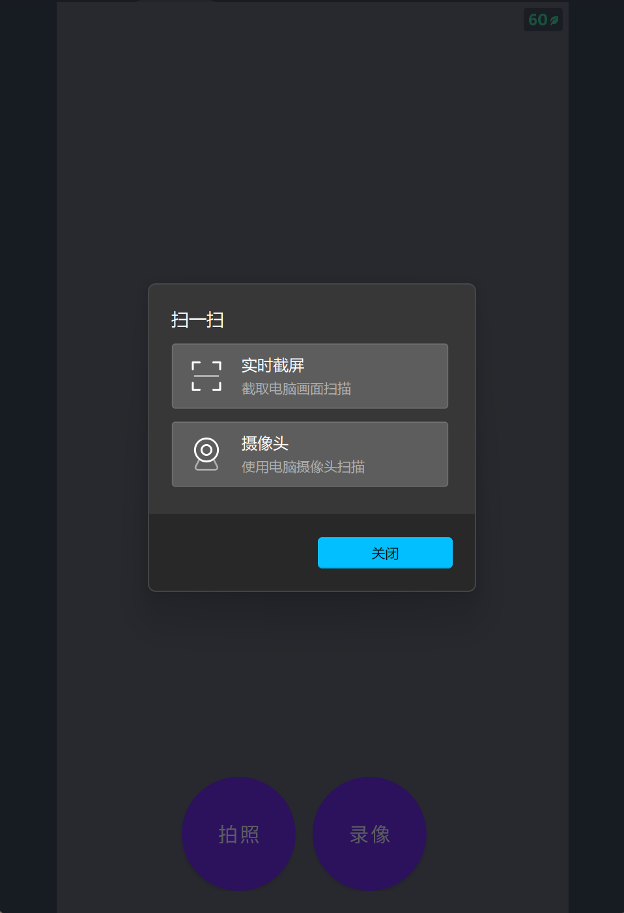
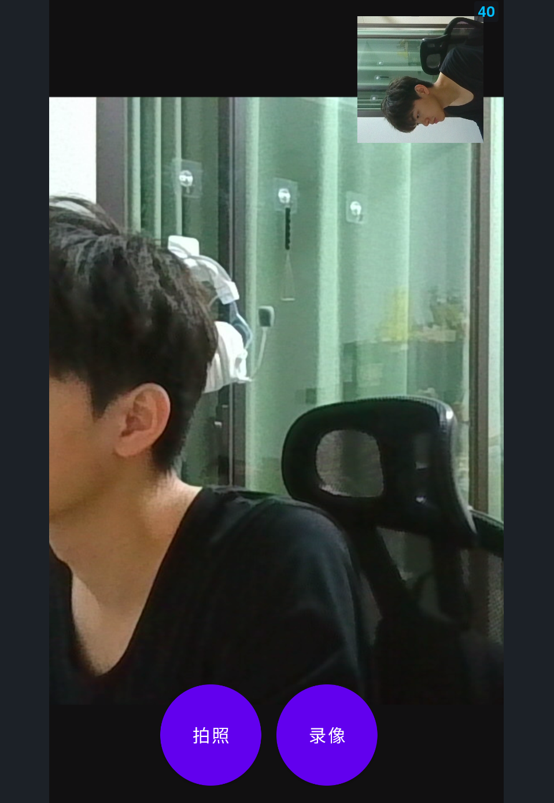
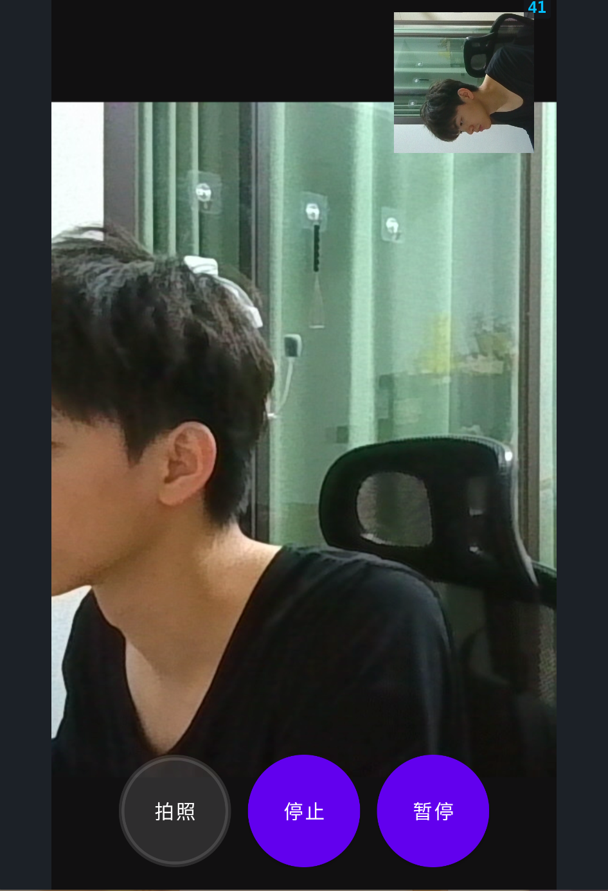
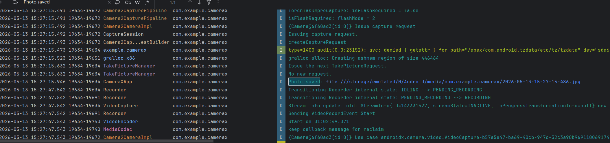
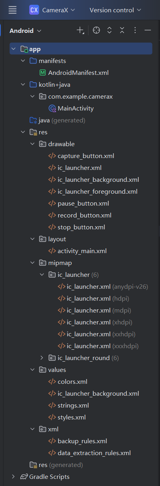

# Android CameraX 应用实验

## 📋 实验目的

1. **掌握 Android CameraX 拍照功能的基本用法** - CameraX 是开发智能应用的必要组件
2. **掌握 Android CameraX 视频捕捉功能的基本用法**
3. **进一步熟悉 Kotlin 语言的特性**

## 📝 实验内容

### 1. CameraX 简介

CameraX 是 Android 最新的支持开发相机应用的 Jetpack 库（API level 21 以上），提供了简单易用的 API，具有以下特点：
- 生命周期感知，自动管理相机资源
- 向后兼容，支持旧版 Android 设备
- 模块化设计，按需使用

### 2. 核心功能实现

| 功能 | 说明 | 状态 |
|------|------|------|
| **Preview** | 将摄像头画面实时显示到界面上 | ✅ 已实现 |
| **ImageCapture** | 支持高质量静态图片捕捉，拍照后显示缩略图 | ✅ 已实现 |
| **VideoCapture** | 录制高清视频，支持暂停/继续功能 | ✅ 已实现 |

### 3. 技术实现

- **语言**：Kotlin
- **最低 API**：21
- **目标 API**：36
- **CameraX 版本**：1.4.0
- **构建工具**：Android Studio Hedgehog | 2023.1.1

## 📁 项目结构

```
d:\.ljx\rjxmyfsj\experience4\
├── app/
│   ├── src/main/
│   │   ├── java/com/example/camerax/
│   │   │   └── MainActivity.kt                    # 主Activity，包含所有CameraX逻辑
│   │   ├── res/
│   │   │   ├── drawable/                          # 按钮样式资源
│   │   │   │   ├── capture_button.xml             # 拍照按钮（白色）
│   │   │   │   ├── record_button.xml              # 录像按钮（红色）
│   │   │   │   ├── stop_button.xml                # 停止按钮（橙色）
│   │   │   │   └── pause_button.xml               # 暂停按钮（黄色）
│   │   │   ├── layout/
│   │   │   │   └── activity_main.xml              # 主布局文件
│   │   │   ├── values/
│   │   │   │   ├── colors.xml                     # 颜色配置
│   │   │   │   ├── strings.xml                    # 字符串资源
│   │   │   │   └── styles.xml                     # 样式配置
│   │   │   └── xml/
│   │   │       ├── backup_rules.xml               # 备份规则
│   │   │       └── data_extraction_rules.xml      # 数据提取规则
│   │   └── AndroidManifest.xml                    # 权限声明和应用配置
│   └── build.gradle                               # 模块级构建配置（含CameraX依赖）
├── build.gradle                                   # 项目级构建配置
├── settings.gradle                                # Gradle设置
├── gradle.properties                              # Gradle属性配置
├── image/                                         # 截图文件夹
│   ├── 1_preview.png
│   ├── 2_capture.png
│   ├── 3_record.png
│   ├── 4_logcat.png
│   ├── 5_logcat.png
│   └── 6_structure.png
└── README.md                                      # 实验报告
```

## 🔑 关键代码实现

### 1. 权限申请

```kotlin
private val REQUEST_CODE_PERMISSIONS = 10
private val REQUIRED_PERMISSIONS = arrayOf(
    Manifest.permission.CAMERA,
    Manifest.permission.RECORD_AUDIO
)

private fun allPermissionsGranted() = REQUIRED_PERMISSIONS.all {
    ContextCompat.checkSelfPermission(baseContext, it) == PackageManager.PERMISSION_GRANTED
}
```

### 2. 初始化 CameraX

```kotlin
private fun startCamera() {
    val cameraProviderFuture = ProcessCameraProvider.getInstance(this)
    
    cameraProviderFuture.addListener({
        val cameraProvider = cameraProviderFuture.get()
        
        // 预览用例
        val preview = Preview.Builder()
            .build()
            .also { it.setSurfaceProvider(viewFinder.surfaceProvider) }
        
        // 拍照用例
        imageCapture = ImageCapture.Builder()
            .setCaptureMode(ImageCapture.CAPTURE_MODE_MINIMIZE_LATENCY)
            .build()
        
        // 录像用例
        val recorder = Recorder.Builder().build()
        videoCapture = VideoCapture.withOutput(recorder)
        
        // 绑定到生命周期
        cameraProvider.bindToLifecycle(
            this, CameraSelector.DEFAULT_BACK_CAMERA, 
            preview, imageCapture, videoCapture
        )
    }, ContextCompat.getMainExecutor(this))
}
```

### 3. 拍照功能

```kotlin
private fun takePhoto() {
    val photoFile = createImageFile()
    val outputOptions = ImageCapture.OutputFileOptions.Builder(photoFile).build()
    
    imageCapture?.takePicture(
        outputOptions,
        ContextCompat.getMainExecutor(this),
        object : ImageCapture.OnImageSavedCallback {
            override fun onImageSaved(output: ImageCapture.OutputFileResults) {
                showPreviewImage(photoFile)  // 显示缩略图
            }
            override fun onError(exc: ImageCaptureException) {
                Log.e(TAG, "Photo capture failed", exc)
            }
        }
    )
}
```

### 4. 录像功能（含暂停/继续）

```kotlin
private fun captureVideo() {
    val currentRecording = recording
    if (currentRecording != null) {
        currentRecording.stop()  // 停止录制
        return
    }
    
    // 开始录制
    val videoFile = createVideoFile()
    recording = videoCapture?.output
        ?.prepareRecording(this, FileOutputOptions.Builder(videoFile).build())
        ?.start(ContextCompat.getMainExecutor(this)) { event ->
            when (event) {
                is VideoRecordEvent.Start -> { /* 录制开始 */ }
                is VideoRecordEvent.Finalize -> { /* 录制结束 */ }
            }
        }
}

private fun togglePauseRecording() {
    if (isRecordingPaused) {
        recording?.resume()  // 继续录制
    } else {
        recording?.pause()   // 暂停录制
    }
}
```

## 📌 权限说明

应用需要以下权限：

| 权限 | 用途 |
|------|------|
| `CAMERA` | 访问摄像头进行预览和拍照 |
| `RECORD_AUDIO` | 录制视频时采集音频 |

## 📷 运行效果

### 1. 应用主界面


### 2. 拍照功能


### 3. 录像功能


### 4. 日志输出


### 5. 项目结构


## 📸 截图清单

**已放入 `image/` 文件夹的截图：**

| 文件名 | 截图内容 | 状态 |
|--------|---------|------|
| `1_preview.png` | 应用启动后的主界面，显示摄像头预览和三个按钮 | ✅ |
| `2_capture.png` | 拍照后的界面，右上角显示缩略图 | ✅ |
| `3_record.png` | 录像中的界面，显示暂停按钮 | ✅ |
| `4_logcat.png` | Logcat 日志输出（拍照成功） | ✅ |
| `5_logcat.png` | Logcat 日志输出（录像成功） | ✅ |
| `6_structure.png` | Android Studio 项目结构 | ✅ |

## 📖 使用说明

1. **首次启动**：打开应用会请求相机和录音权限，请点击**允许**
2. **预览画面**：应用启动后自动显示摄像头预览
3. **拍照**：点击白色圆形"拍照"按钮，拍照后右上角显示缩略图
4. **录像**：点击红色圆形"录像"按钮开始录制，按钮变为橙色"停止"
5. **暂停/继续**：录像时点击黄色"暂停"按钮暂停，再次点击"继续"恢复
6. **停止录像**：点击橙色"停止"按钮结束录制

## 📊 实验总结

### 已完成功能

| 功能 | 说明 |
|------|------|
| ✅ **Preview** | 实时摄像头预览，使用 PreviewView 显示 |
| ✅ **ImageCapture** | 高质量拍照，自动保存到外部存储，显示缩略图 |
| ✅ **VideoCapture** | 高清视频录制，支持暂停/继续，保存为 MP4 格式 |

### 学习收获

通过本次实验，我学习了：
- CameraX 的基本架构和四大核心用例（Preview、ImageCapture、VideoCapture、ImageAnalysis）
- Android 权限申请流程（运行时权限申请）
- Kotlin 语言特性（Lambda 表达式、空安全、扩展函数）
- Android 布局设计（ConstraintLayout、LinearLayout）
- 相机资源的生命周期管理

### 代码优化

代码采用了以下优化策略：
- 函数拆分：将初始化逻辑拆分为独立函数
- 命名规范：使用语义化的函数和变量命名
- 代码组织：按功能分组，提高可读性
- 资源管理：正确关闭相机和线程资源

## 🔮 扩展实验建议

后续可尝试添加以下功能：
- 前后摄像头切换
- 闪光灯控制（开启/关闭/自动）
- 实时滤镜效果
- 图片裁剪和编辑
- 视频预览和播放
- 二维码扫描（使用 ImageAnalysis）
- 人脸识别（结合 ML Kit）

## 📚 参考资源

- [CameraX 官方文档](https://developer.android.com/training/camerax)
- [CameraX 使用入门 Codelab](https://developer.android.com/codelabs/camerax-getting-started)
- [实验教程（CSDN）](https://blog.csdn.net/llfjfz/article/details/129924593)
- [Kotlin 官方文档](https://kotlinlang.org/docs/home.html)
