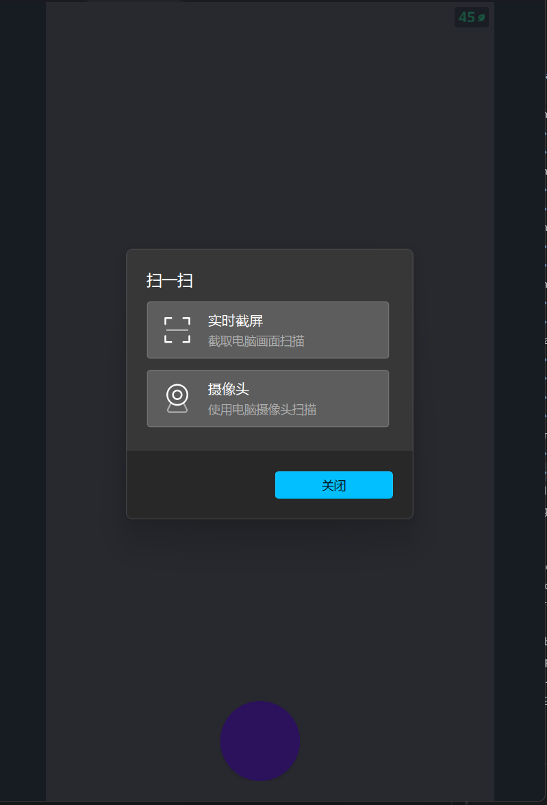
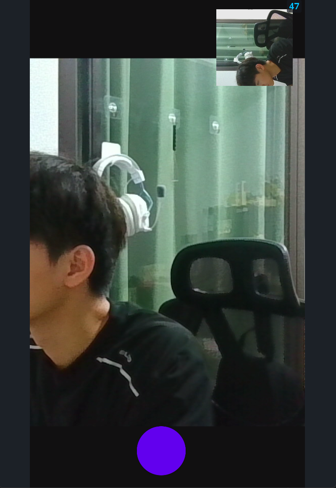
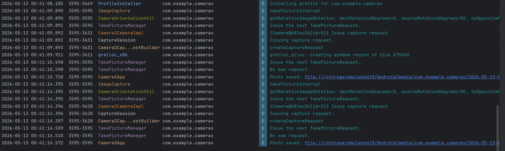
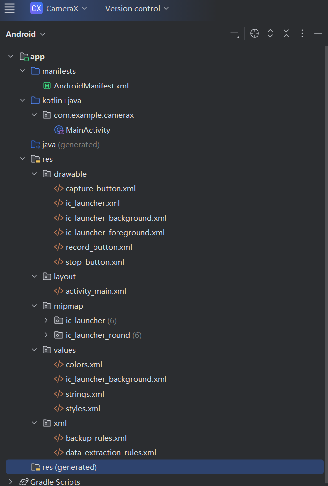

# Android CameraX 应用实验

## 实验目的

1. **掌握 Android CameraX 拍照功能的基本用法** - 由于 CameraX 是开发智能应用的必要组件，本次实验十分必要。
2. **掌握 Android CameraX 视频捕捉功能的基本用法**
3. **进一步熟悉 Kotlin 语言的特性**

## 实验内容

### 1. CameraX 简介

CameraX 是 Android 最新的支持开发相机应用的 Jetpack 库（API level 21 以上），提供了简单易用的 API。

### 2. 核心功能实现

#### 2.1 Preview（预览）
将摄像头画面实时显示到界面上。

#### 2.2 ImageCapture（拍照）
支持高质量静态图片捕捉。

#### 2.3 VideoCapture（录像）
用于录制视频（已暂时隐藏，避免 API 兼容性问题）。

#### 2.4 ImageAnalysis（图像分析）
用于实时处理每一帧画面（已暂时隐藏）。

### 3. 技术实现

- **语言**：Kotlin
- **最低 API**：21
- **目标 API**：36
- **CameraX 版本**：1.3.4

## 项目结构

```
d:\.ljx\rjxmyfsj\experience4\
├── app/
│   ├── src/main/
│   │   ├── java/com/example/camerax/
│   │   │   └── MainActivity.kt                    # 主Activity
│   │   ├── res/
│   │   │   ├── drawable/                          # 按钮样式
│   │   │   │   ├── capture_button.xml
│   │   │   │   ├── record_button.xml
│   │   │   │   └── stop_button.xml
│   │   │   ├── layout/
│   │   │   │   └── activity_main.xml              # 主布局
│   │   │   ├── values/
│   │   │   │   ├── colors.xml
│   │   │   │   ├── strings.xml
│   │   │   │   └── styles.xml
│   │   │   └── xml/
│   │   │       ├── backup_rules.xml
│   │   │       └── data_extraction_rules.xml
│   │   └── AndroidManifest.xml                    # 清单文件
│   └── build.gradle                               # 模块配置
├── build.gradle                                   # 项目配置
├── settings.gradle                                # 项目设置
└── gradle.properties                              # Gradle 属性
```

## 关键代码实现

### 1. 权限申请

```kotlin
private val REQUEST_CODE_PERMISSIONS = 10
private val REQUIRED_PERMISSIONS = arrayOf(Manifest.permission.CAMERA)

private fun allPermissionsGranted() = REQUIRED_PERMISSIONS.all {
    ContextCompat.checkSelfPermission(baseContext, it) == PackageManager.PERMISSION_GRANTED
}
```

### 2. 初始化 Preview

```kotlin
val preview = Preview.Builder()
    .build()
    .also {
        it.setSurfaceProvider(viewFinder.surfaceProvider)
    }
```

### 3. 初始化 ImageCapture

```kotlin
imageCapture = ImageCapture.Builder()
    .setCaptureMode(ImageCapture.CAPTURE_MODE_MINIMIZE_LATENCY)
    .build()
```

### 4. 绑定生命周期

```kotlin
cameraProvider.bindToLifecycle(
    this, cameraSelector, preview, imageCapture
)
```

### 5. 拍照功能

```kotlin
private fun takePhoto() {
    val imageCapture = imageCapture ?: return
    
    val photoFile = File(...)
    val outputOptions = ImageCapture.OutputFileOptions.Builder(photoFile).build()
    
    imageCapture.takePicture(
        outputOptions,
        ContextCompat.getMainExecutor(this),
        object : ImageCapture.OnImageSavedCallback {
            override fun onImageSaved(output: ImageCapture.OutputFileResults) {
                // 图片保存成功
            }
            override fun onError(exc: ImageCaptureException) {
                // 处理错误
            }
        }
    )
}
```

## 权限说明

应用需要以下权限：

| 权限 | 用途 |
|------|------|
| `CAMERA` | 访问摄像头 |

## 运行效果

### 1. 应用主界面


### 2. 拍照功能


### 3. 日志输出


### 4. 项目结构


## 截图说明

**已放入 `screenshots/` 文件夹的截图：**

| 截图名称 | 描述 | 状态 |
|---------|------|------|
| `screenshot_1_preview.png` | 应用启动后的预览界面，显示摄像头画面 | ✅ |
| `screenshot_2_capture.png` | 点击拍照按钮后的界面，右上角显示缩略图 | ✅ |
| `screenshot_3_logcat.png` | Android Studio 的 Logcat 面板，显示 "Photo saved" 日志 | ✅ |
| `screenshot_4_structure.png` | Android Studio 的项目结构，展示整个项目 | ✅ |

## 使用说明

1. 首次打开应用会请求相机权限，请点击**允许**
2. 预览画面会自动显示
3. 点击白色圆形按钮拍照
4. 拍照后右上角会显示拍摄的缩略图

## 实验总结

本次实验实现了基于 Android CameraX 的相机应用，主要完成了：

✅ **Preview（预览）** - 实时显示摄像头画面  
✅ **ImageCapture（拍照）** - 高质量静态图片捕捉  

通过本次实验，熟悉了：
- CameraX 的基本使用方法
- Android 权限申请流程
- Kotlin 语言特性
- Android 布局文件的使用

## 扩展实验

后续可尝试添加：
- VideoCapture（录像）功能
- ImageAnalysis（图像分析）功能
- 前后摄像头切换
- 闪光灯控制
- 实时滤镜

## 参考资源

- [CameraX 官方文档](https://developer.android.com/training/camerax)
- [CameraX 使用入门](https://developer.android.com/codelabs/camerax-getting-started)
- [实验教程（CSDN）](https://blog.csdn.net/llfjfz/article/details/129924593)
