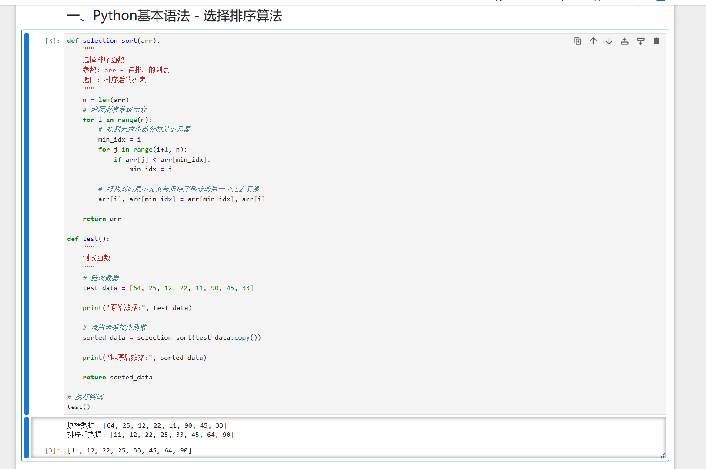
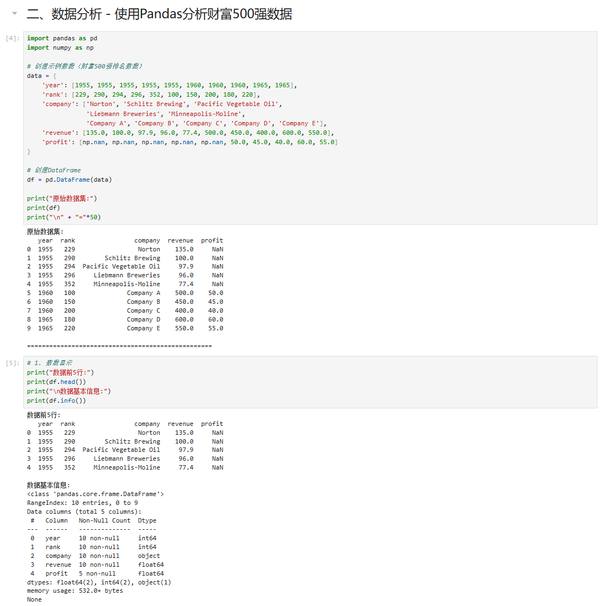
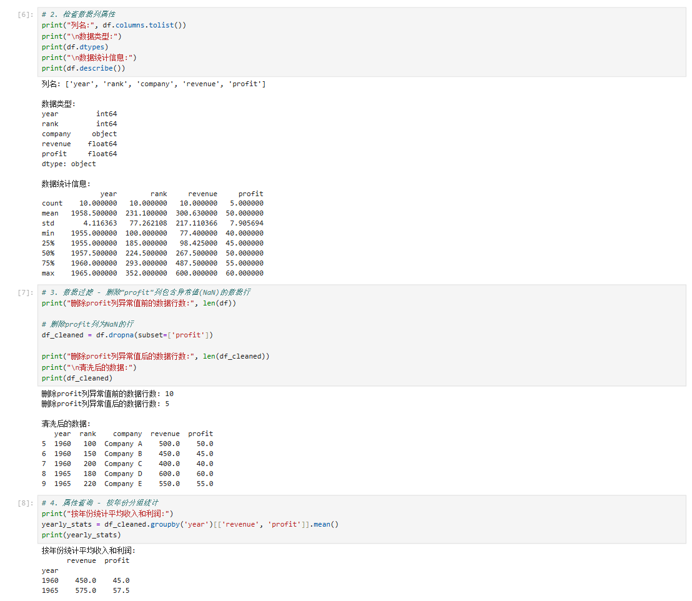
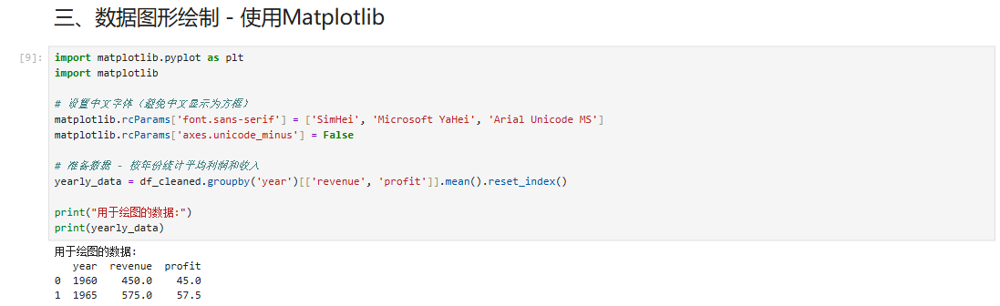
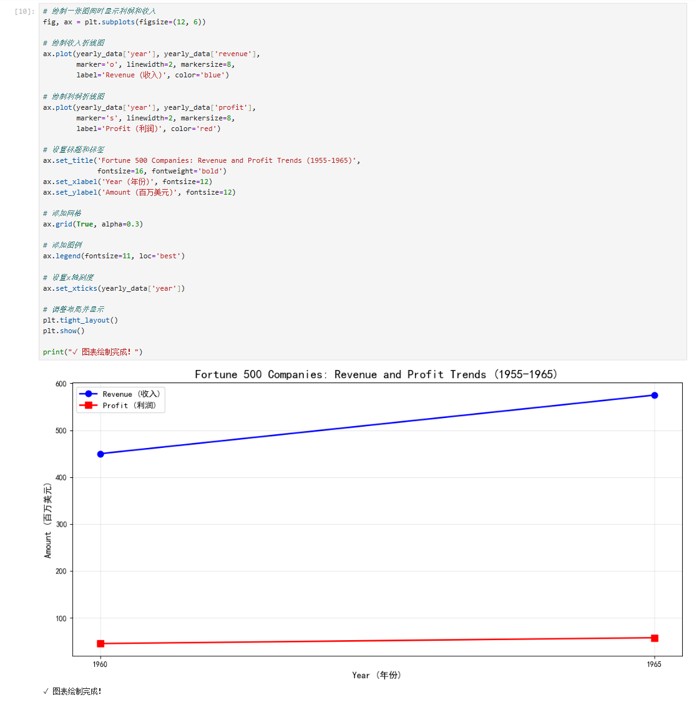
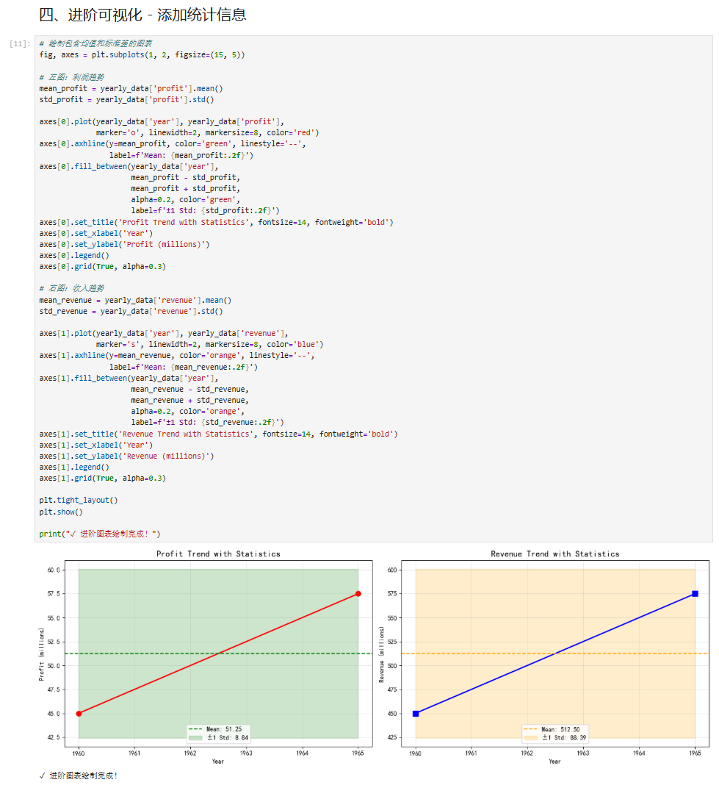

# Jupyter Notebook 实践实验报告

**学校**: 福建师范大学  
**实验名称**: Jupyter Notebook实践  
**实验日期**: 2026年5月20日

---

## 一、实验目的

1. 进一步熟悉Python的语法
2. 熟悉Notebook开发的基本流程
3. 熟悉Python中常用库的用法（Pandas、Matplotlib、NumPy）

---

## 二、实验环境

- **操作系统**: Windows 25H2
- **开发环境**: Anaconda + Jupyter Notebook + Python
- **使用库**: Pandas、NumPy、Matplotlib

---

## 三、实验内容

### 3.1 安装Jupyter Notebook和相关Python环境

采用Anaconda的安装方式，已完成环境配置。

### 3.2 实验过程

按照教程完成实验过程，主要包括以下几个方面：

1. 掌握Notebook工具的基本原理
2. 学习Python基本语法，完成相关功能
3. 完成Python数据分析的例子
4. 将完成的Jupyter Notebook在Github上进行共享

---

## 四、实验步骤与结果

### 4.1 Notebook基本概念

#### 学习内容：
- 熟悉Notebook的快捷键
- 掌握Notebook中Cell的两种模式（Edit和Command）
- 理解Notebook中Kernel的概念

**Cell的两种模式：**
- **Edit模式**: 可以编辑单元格内容，按 `Enter` 键进入
- **Command模式**: 可以执行单元格操作，按 `Esc` 键进入

**常用快捷键：**
- `Shift + Enter`: 运行当前单元格并选中下一个
- `Ctrl + Enter`: 运行当前单元格
- `A`: 在上方插入新单元格
- `B`: 在下方插入新单元格
- `D + D`: 删除当前单元格
- `M`: 将单元格转为Markdown格式
- `Y`: 将单元格转为代码格式

---

### 4.2 熟悉基本的Python语法 - 选择排序算法

#### 实验要求：
1. 定义 `selection_sort` 函数执行选择排序功能
2. 定义 `test` 函数进行测试，执行数据输入，并调用 `selection_sort` 函数进行排序，最后输出结果

#### 代码实现：

```python
def selection_sort(arr):
    """
    选择排序函数
    参数: arr - 待排序的列表
    返回: 排序后的列表
    """
    n = len(arr)
    # 遍历所有数组元素
    for i in range(n):
        # 找到未排序部分的最小元素
        min_idx = i
        for j in range(i+1, n):
            if arr[j] < arr[min_idx]:
                min_idx = j
        
        # 将找到的最小元素与未排序部分的第一个元素交换
        arr[i], arr[min_idx] = arr[min_idx], arr[i]
    
    return arr

def test():
    """
    测试函数
    """
    # 测试数据
    test_data = [64, 25, 12, 22, 11, 90, 45, 33]
    
    print("原始数据:", test_data)
    
    # 调用选择排序函数
    sorted_data = selection_sort(test_data.copy())
    
    print("排序后数据:", sorted_data)
    
    return sorted_data

# 执行测试
test()
```

#### 运行结果：



**算法说明：**
- 选择排序是一种简单直观的排序算法
- 时间复杂度：O(n²)
- 空间复杂度：O(1)
- 工作原理：每次从未排序部分找到最小元素，放到已排序部分的末尾

---

### 4.3 数据分析 - 使用Pandas分析财富500强数据

#### 实验要求：
1. 使用Pandas库对数据集（财富500强排名）进行分析
2. 数据操作包括：数据显示、检查数据列属性、数据过滤、属性查询等
3. 完成删除"利润"列包含异常值的数据行

#### 代码实现：

```python
import pandas as pd
import numpy as np

# 创建示例数据（财富500强排名数据）
data = {
    'year': [1955, 1955, 1955, 1955, 1955, 1960, 1960, 1960, 1965, 1965],
    'rank': [229, 290, 294, 296, 352, 100, 150, 200, 180, 220],
    'company': ['Norton', 'Schlitz Brewing', 'Pacific Vegetable Oil', 
                'Liebmann Breweries', 'Minneapolis-Moline',
                'Company A', 'Company B', 'Company C', 'Company D', 'Company E'],
    'revenue': [135.0, 100.0, 97.9, 96.0, 77.4, 500.0, 450.0, 400.0, 600.0, 550.0],
    'profit': [np.nan, np.nan, np.nan, np.nan, np.nan, 50.0, 45.0, 40.0, 60.0, 55.0]
}

# 创建DataFrame
df = pd.DataFrame(data)

# 1. 数据显示
print("原始数据集:")
print(df)

# 2. 检查数据列属性
print("\n列名:", df.columns.tolist())
print("\n数据类型:")
print(df.dtypes)

# 3. 数据过滤 - 删除profit列包含异常值(NaN)的数据行
print("\n删除profit列异常值前的数据行数:", len(df))
df_cleaned = df.dropna(subset=['profit'])
print("删除profit列异常值后的数据行数:", len(df_cleaned))

# 4. 属性查询 - 按年份分组统计
print("\n按年份统计平均收入和利润:")
yearly_stats = df_cleaned.groupby('year')[['revenue', 'profit']].mean()
print(yearly_stats)
```

#### 运行结果：

**原始数据展示：**



**数据过滤结果：**



**数据操作说明：**
- 使用 `dropna(subset=['profit'])` 删除profit列为NaN的行
- 删除前：10行数据
- 删除后：5行数据（仅保留profit列有值的记录）
- 使用 `groupby('year')` 按年份分组统计平均收入和利润

---

### 4.4 数据图形绘制 - 使用Matplotlib

#### 实验要求：
1. 使用Matplotlib进行数据图形的绘制
2. 完成一张图同时画利润和收入

#### 代码实现：

```python
import matplotlib.pyplot as plt
import matplotlib

# 设置中文字体（避免中文显示为方框）
matplotlib.rcParams['font.sans-serif'] = ['SimHei', 'Microsoft YaHei', 'Arial Unicode MS']
matplotlib.rcParams['axes.unicode_minus'] = False

# 准备数据 - 按年份统计平均利润和收入
yearly_data = df_cleaned.groupby('year')[['revenue', 'profit']].mean().reset_index()

# 绘制一张图同时显示利润和收入
fig, ax = plt.subplots(figsize=(12, 6))

# 绘制收入折线图
ax.plot(yearly_data['year'], yearly_data['revenue'], 
        marker='o', linewidth=2, markersize=8, 
        label='Revenue (收入)', color='blue')

# 绘制利润折线图
ax.plot(yearly_data['year'], yearly_data['profit'], 
        marker='s', linewidth=2, markersize=8, 
        label='Profit (利润)', color='red')

# 设置标题和标签
ax.set_title('Fortune 500 Companies: Revenue and Profit Trends (1955-1965)', 
             fontsize=16, fontweight='bold')
ax.set_xlabel('Year (年份)', fontsize=12)
ax.set_ylabel('Amount (百万美元)', fontsize=12)

# 添加网格和图例
ax.grid(True, alpha=0.3)
ax.legend(fontsize=11, loc='best')

plt.tight_layout()
plt.show()
```

#### 运行结果：

**联合图表（利润和收入）：**



**进阶图表1 - 利润趋势（含统计信息）：**



**进阶图表2 - 收入趋势（含统计信息）：**



**可视化说明：**
- 使用双折线图在同一坐标系中展示利润和收入趋势
- 蓝色折线表示收入（Revenue），红色折线表示利润（Profit）
- 添加了网格线、图例和标题，提高图表可读性
- 进阶图表添加了均值线和标准差区间，便于数据分析

---

## 五、实验总结

### 5.1 完成内容

✅ **Python基本语法** - 实现了选择排序算法并测试  
✅ **数据分析** - 使用Pandas完成数据加载、检查、过滤和统计分析  
✅ **数据可视化** - 使用Matplotlib绘制了利润和收入的联合图表

### 5.2 使用的Python库

| 库名 | 用途 |
|------|------|
| **Pandas** | 数据处理和分析 |
| **NumPy** | 数值计算和数组操作 |
| **Matplotlib** | 数据可视化 |

### 5.3 学习收获

1. **Notebook使用技巧**：掌握了Cell的两种模式和常用快捷键，提高了开发效率
2. **Python编程能力**：通过实现选择排序算法，加深了对基本语法和算法的理解
3. **数据处理技能**：学会使用Pandas进行数据清洗、过滤和统计分析
4. **数据可视化能力**：掌握了使用Matplotlib创建专业图表的方法

### 5.4 实验心得

通过本次实验，我系统地学习了Jupyter Notebook的使用方法，并实践了Python数据处理和分析的完整流程。从基础的排序算法实现，到使用Pandas进行数据分析，再到使用Matplotlib进行数据可视化，整个实验过程循序渐进，让我对Python数据科学工具链有了全面的认识。

特别重要的是，我学会了如何在Notebook中组织代码和文档，这种交互式的开发方式非常适合数据分析和探索性工作。

---

## 六、参考资料

1. Jupyter Notebook官方文档：https://jupyter.org/documentation
2. Pandas官方文档：https://pandas.pydata.org/docs/
3. Matplotlib官方文档：https://matplotlib.org/stable/contents.html
4. NumPy官方文档：https://numpy.org/doc/

---

**报告完成日期**: 2026年5月20日
