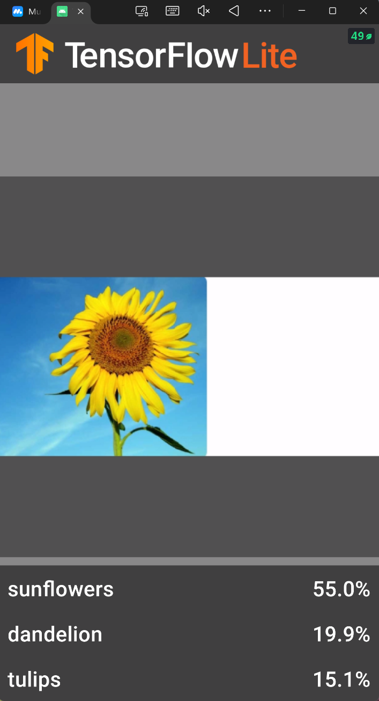
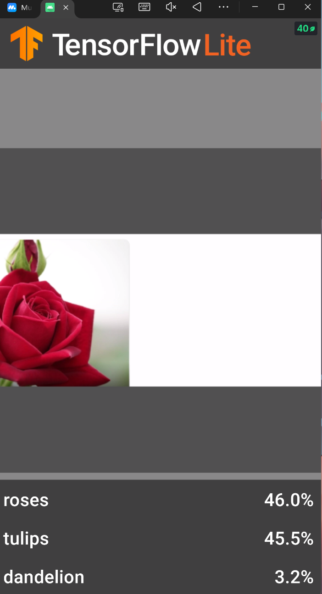
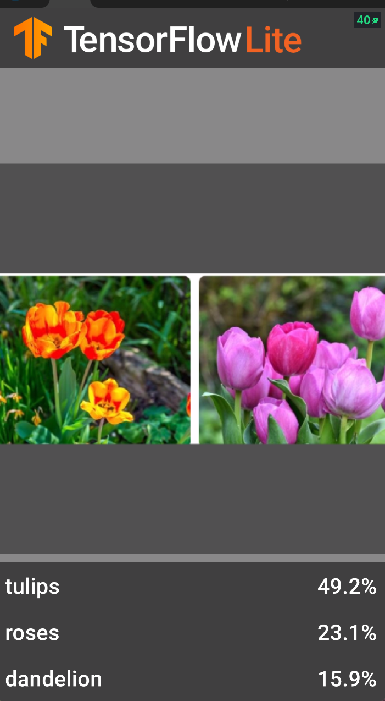
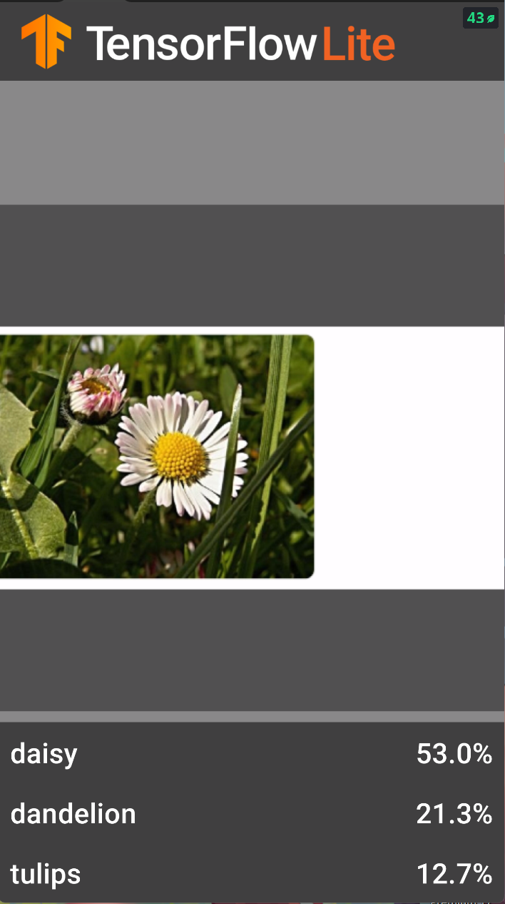
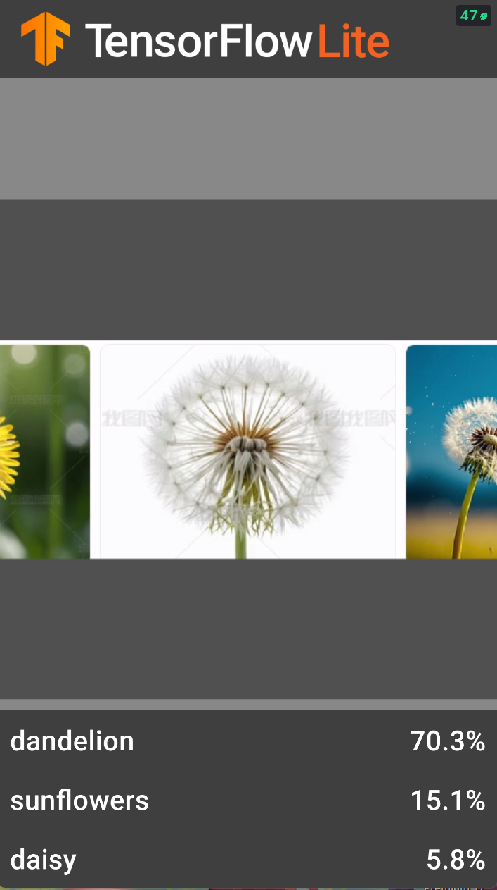
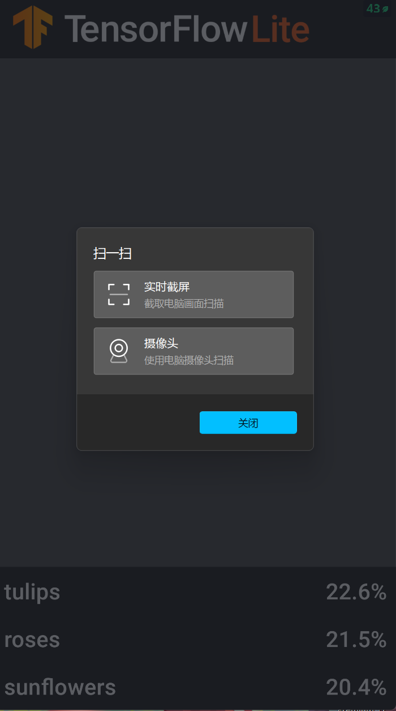
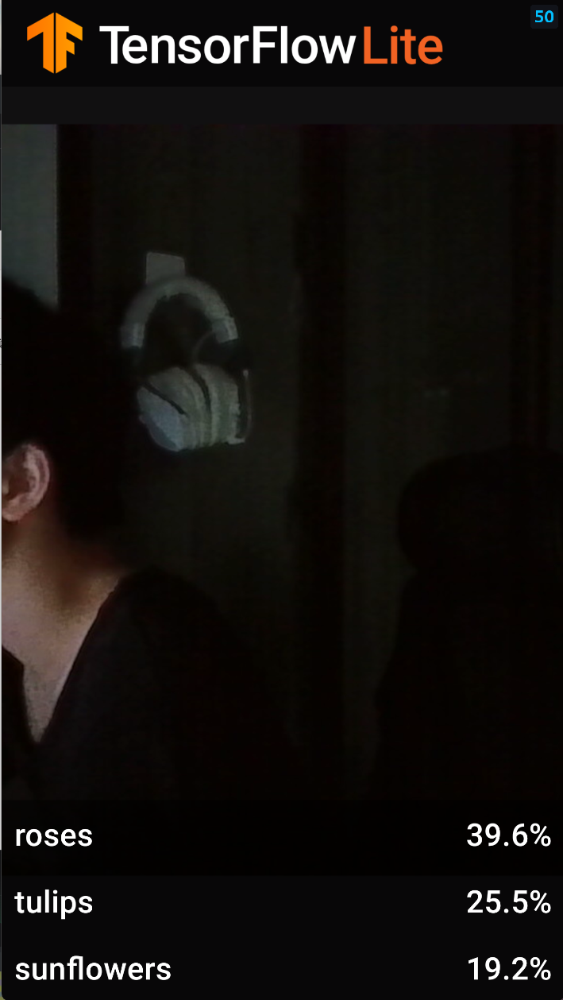
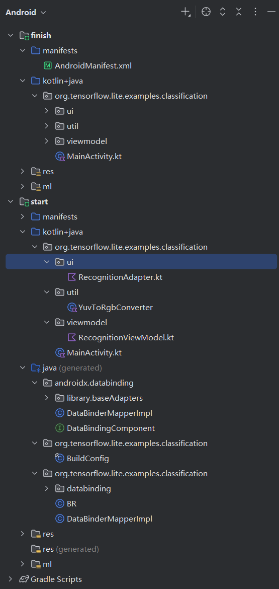

# TensorFlow Lite 花卉识别应用实验报告

## 一、实验目的

1. 了解基于 TensorFlow Lite 的移动端机器学习应用开发流程
2. 掌握 CameraX 库的使用，实现相机预览和图像分析
3. 学习使用 ML Model Binding 集成 TensorFlow Lite 模型
4. 理解 MVVM 架构在 Android 应用中的应用

## 二、实验环境

| 项目                    | 版本            |
| :-------------------- | :------------ |
| 操作系统                  | Windows 10/11 |
| Android Studio        | Hedgehog      |
| Gradle                | 8.7           |
| Android Gradle Plugin | 8.5.0         |
| Kotlin                | 1.9.22        |
| Target SDK            | 34            |
| Min SDK               | 21            |

## 三、实验步骤

### 3.1 项目框架分析

项目采用标准的 Android MVVM 架构，主要组件包括：

- **MainActivity**: 主界面，管理 CameraX 生命周期
- **ImageAnalyzer**: 图像分析器，处理相机帧并进行模型推理
- **RecognitionListViewModel**: 数据视图模型，管理识别结果
- **RecognitionAdapter**: RecyclerView 适配器，展示识别结果

### 3.2 TODO 代码项实现

按照教程完成了以下 TODO 项：

**TODO 1: 添加 TensorFlow Lite 模型**

```kotlin
private val flowerModel: FlowerModel by lazy {
    val options = Model.Options.Builder().setNumThreads(4).build()
    FlowerModel.newInstance(ctx, options)
}
```

**TODO 2: 图像转换**

```kotlin
val tfImage = TensorImage.fromBitmap(toBitmap(imageProxy))
```

**TODO 3: 模型推理**

```kotlin
val outputs = flowerModel.process(tfImage)
    .probabilityAsCategoryList.apply {
        sortByDescending { it.score }
    }.take(MAX_RESULT_DISPLAY)
```

**TODO 4: 结果转换**

```kotlin
for (output in outputs) {
    items.add(Recognition(output.label, output.score))
}
```

### 3.3 CameraX 库使用

CameraX 是 Jetpack 组件库，提供了简化的相机 API：

```kotlin
// 预览用例
preview = Preview.Builder()
    .setTargetResolution(Size(640, 480))
    .build()

// 图像分析用例
imageAnalyzer = ImageAnalysis.Builder()
    .setBackpressureStrategy(ImageAnalysis.STRATEGY_KEEP_ONLY_LATEST)
    .build()
    .also {
        it.setAnalyzer(cameraExecutor, ImageAnalyzer(this) { items ->
            recogViewModel.updateData(items)
        })
    }
```

### 3.4 模型导入

将 `FlowerModel.tflite` 模型文件放置在 `src/main/ml/` 目录下，Android Studio 会自动生成模型绑定类。

## 四、代码框架分析

### 4.1 核心架构

```
┌─────────────────────────────────────────────────────────┐
│                    MainActivity                        │
│  ┌──────────┐  ┌──────────────┐  ┌─────────────────┐ │
│  │  Preview │  │ ImageAnalysis │  │    Camera      │ │
│  └────┬─────┘  └──────┬───────┘  └────────┬────────┘ │
│       │               │                    │          │
│       │               ▼                    │          │
│       │    ┌──────────────────┐            │          │
│       │    │  ImageAnalyzer   │            │          │
│       │    │  - 图像转换      │            │          │
│       │    │  - 模型推理      │            │          │
│       │    │  - 结果回调      │            │          │
│       │    └────────┬─────────┘            │          │
│       │             │                      │          │
│       ▼             ▼                      ▼          │
│  ┌─────────────────────────────────────────────────┐   │
│  │           RecognitionListViewModel              │   │
│  │         (LiveData<List<Recognition>>)          │   │
│  └────────────────────┬──────────────────────────┘   │
│                       │                              │
│                       ▼                              │
│  ┌─────────────────────────────────────────────────┐   │
│  │           RecognitionAdapter                    │   │
│  │         (RecyclerView ListAdapter)             │   │
│  └─────────────────────────────────────────────────┘   │
└─────────────────────────────────────────────────────────┘
```

### 4.2 关键代码文件

| 文件                            | 功能              | 位置                                                                                                                                                                                                            |
| :---------------------------- | :-------------- | :------------------------------------------------------------------------------------------------------------------------------------------------------------------------------------------------------------ |
| `MainActivity.kt`             | 主界面与 CameraX 配置 | [start/src/main/java/.../MainActivity.kt](file:///d:.ljx\rjxmyfsj\experience6\TFLClassify-main\start\src\main\java\org\tensorflow\lite\examples\classification\MainActivity.kt)                               |
| `RecognitionListViewModel.kt` | 数据视图模型          | [start/src/main/java/.../RecognitionListViewModel.kt](file:///d:.ljx\rjxmyfsj\experience6\TFLClassify-main\start\src\main\java\org\tensorflow\lite\examples\classification\viewmodel\RecognitionViewModel.kt) |
| `RecognitionAdapter.kt`       | 结果展示适配器         | [start/src/main/java/.../RecognitionAdapter.kt](file:///d:.ljx\rjxmyfsj\experience6\TFLClassify-main\start\src\main\java\org\tensorflow\lite\examples\classification\ui\RecognitionAdapter.kt)                |
| `YuvToRgbConverter.kt`        | YUV 到 RGB 转换工具  | [start/src/main/java/.../YuvToRgbConverter.kt](file:///d:.ljx\rjxmyfsj\experience6\TFLClassify-main\start\src\main\java\org\tensorflow\lite\examples\classification\util\YuvToRgbConverter.kt)                |

### 4.3 模型推理流程

```kotlin
// 1. 获取相机帧
override fun analyze(imageProxy: ImageProxy) {
    
    // 2. 转换为 Bitmap
    val tfImage = TensorImage.fromBitmap(toBitmap(imageProxy))
    
    // 3. 模型推理
    val outputs = flowerModel.process(tfImage)
        .probabilityAsCategoryList.apply {
            sortByDescending { it.score }
        }.take(MAX_RESULT_DISPLAY)
    
    // 4. 转换为 Recognition 对象
    for (output in outputs) {
        items.add(Recognition(output.label, output.score))
    }
    
    // 5. 更新 UI
    listener(items.toList())
    imageProxy.close()
}
```

## 五、运行效果展示

### 5.1 模型支持的类别

模型基于 `tf_flowers` 数据集训练，支持识别以下 5 种花：

| 序号 | 类别  | 英文名称       |
| :- | :-- | :--------- |
| 1  | 雏菊  | daisy      |
| 2  | 蒲公英 | dandelion  |
| 3  | 玫瑰  | roses      |
| 4  | 向日葵 | sunflowers |
| 5  | 郁金香 | tulips     |

### 5.2 识别结果截图

#### 🌻 向日葵 (Sunflowers)



#### 🌹 玫瑰 (Roses)



#### 🌷 郁金香 (Tulips)



#### 🌼 雏菊 (Daisy)



#### 🌿 蒲公英 (Dandelion)



### 5.3 应用界面截图

#### 应用启动界面



#### 相机预览界面



#### 项目结构



## 六、实验总结

### 6.1 技术要点

1. **CameraX 简化了相机操作**：提供了生命周期感知的相机管理，自动处理权限和设备兼容性
2. **ML Model Binding 自动生成代码**：Android Studio 自动根据 tflite 模型生成 `FlowerModel` 类，简化模型调用
3. **LiveData 实现数据绑定**：ViewModel + LiveData 模式实现了 UI 与数据的解耦
4. **异步推理**：模型推理在独立线程中执行，避免阻塞主线程

### 6.2 问题与解决方案

| 问题              | 原因                  | 解决方案                    |
| :-------------- | :------------------ | :---------------------- |
| KAPT 编译错误       | JDK 17+ 模块限制        | 添加 `--add-opens` JVM 参数 |
| GPU Delegate 崩溃 | 依赖版本不兼容             | 移除 GPU 依赖，使用 CPU 模式     |
| JVM Target 不匹配  | Kotlin 与 Java 版本不一致 | 统一设置为 Java 8            |

### 6.3 扩展建议

1. **添加 GPU 加速**：确保 `tensorflow-lite-gpu` 依赖版本与 `tensorflow-lite-support` 一致
2. **增加置信度阈值过滤**：只显示置信度高于阈值的结果
3. **添加历史记录功能**：保存识别历史供用户查看
4. **支持图片上传识别**：除相机外支持从相册选择图片

## 七、项目结构

### 7.1 目录结构

```
TFLClassify-main/
├── start/                    # 待完成的框架代码（已完成）
│   ├── src/main/
│   │   ├── java/org/tensorflow/lite/examples/classification/
│   │   │   ├── MainActivity.kt          # 主界面与 CameraX 配置
│   │   │   ├── ui/
│   │   │   │   └── RecognitionAdapter.kt  # 识别结果适配器
│   │   │   ├── util/
│   │   │   │   └── YuvToRgbConverter.kt  # YUV 转 RGB 工具
│   │   │   └── viewmodel/
│   │   │       └── RecognitionViewModel.kt  # 数据视图模型
│   │   ├── ml/
│   │   │   └── FlowerModel.tflite       # TensorFlow Lite 花卉识别模型
│   │   └── res/
│   │       ├── layout/
│   │       │   ├── activity_main.xml      # 主界面布局
│   │       │   └── recognition_item.xml   # 识别结果项布局
│   │       └── drawable/
│   │           └── ic_launcher_*.xml     # 应用图标资源
│   └── build.gradle                      # 模块构建配置
├── finish/                   # 参考完成代码
│   └── src/main/             # 结构同 start 模块
├── image/                    # 实验截图目录
│   ├── daisy.png             # 雏菊识别结果
│   ├── dandelion.png         # 蒲公英识别结果
│   ├── roses.png             # 玫瑰识别结果
│   ├── sunflowers.png        # 向日葵识别结果
│   ├── tulips.png            # 郁金香识别结果
│   ├── launch.png            # 应用启动界面
│   ├── camera.png            # 相机预览界面
│   └── project.png           # 项目结构截图
├── gradle/
│   └── wrapper/
│       ├── gradle-wrapper.jar
│       └── gradle-wrapper.properties
├── build.gradle              # 项目根构建配置
├── gradle.properties         # Gradle 全局属性配置
├── settings.gradle           # 项目模块配置
├── gradlew                   # Linux/Mac 构建脚本
├── gradlew.bat               # Windows 构建脚本
├── README.md                 # 项目说明文档
└── README_EXPERIMENT.md      # 实验报告（本文件）
```

### 7.2 核心文件说明

| 文件 | 功能 | 说明 |
| :--- | :--- | :--- |
| `MainActivity.kt` | 主界面 | 管理 CameraX 生命周期，协调相机预览和图像分析 |
| `ImageAnalyzer` | 图像分析器 | 内部类，处理相机帧并执行模型推理 |
| `RecognitionListViewModel.kt` | 数据模型 | 使用 LiveData 管理识别结果列表 |
| `RecognitionAdapter.kt` | 列表适配器 | 展示识别结果的 RecyclerView 适配器 |
| `YuvToRgbConverter.kt` | 图像转换 | 将 CameraX 的 YUV 格式转换为 RGB/Bitmap |
| `FlowerModel.tflite` | ML 模型 | TensorFlow Lite 花卉分类模型 |

### 7.3 模块说明

| 模块 | 用途 | 状态 |
| :--- | :--- | :--- |
| `start/` | 学生完成代码的主模块 | ✅ 已完成所有 TODO |
| `finish/` | 参考实现代码 | 📖 提供完成参考 |

## 八、参考文献

1. [TensorFlow Lite Model Maker](https://www.tensorflow.org/lite/tutorials/model_maker_image_classification)
2. [CameraX 官方文档](https://developer.android.com/training/camerax)
3. [ML Model Binding](https://developer.android.com/studio/ml-models)
4. [Android MVVM 架构指南](https://developer.android.com/jetpack/guide)

***

**实验日期**：2026年5月\
**实验环境**：Android Studio Hedgehog + Kotlin\
**项目地址**：<https://github.com/your-repo/TFLClassify>
